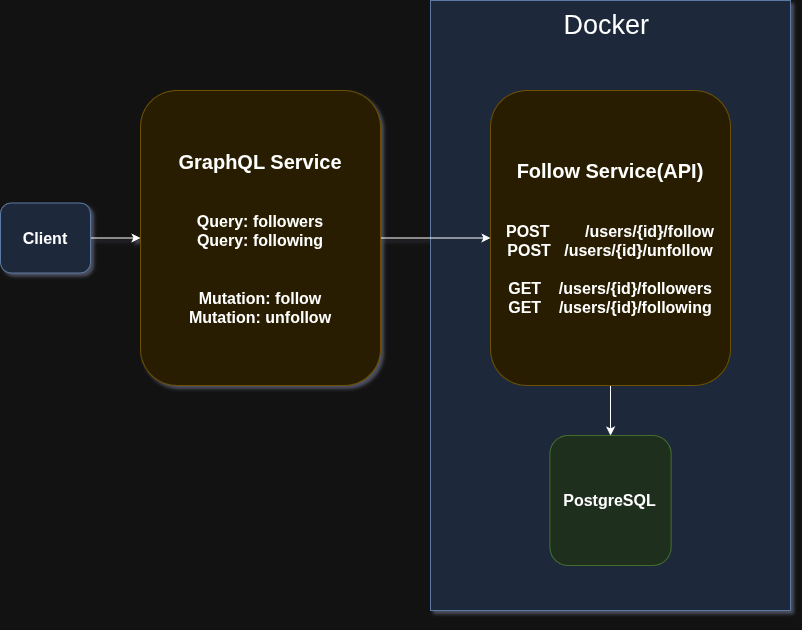

# graphql-service

## Assignment Overview
This project is part of the Backend Engineering Internship Assignment

It consists of two microservices:
- **Follow Service** - a REST API that manages user follow and unfollow operations, stores data in Postgre DB. [Repo Link](https://github.com/Infamous003/follow-service)

- **GraphQL Service** - a gateway that exposes the Follow Service via graphql queries and mutations.

Both of these are in their own repo, and deployed separately on Render. Link for Follow Service: 

---

## Tech Stack
- **Go** - Chosen for its popularity in microservices
- **Chi** - A lightweight router suitable for this small services(Gin or Fiber would be overkill)
- **PostgreSQL** - Suitable for user–follower relationship
- **Docker** - For containerization and deployment
- **gqlgen** - For easier development of graphql services

---

## Architecture Overview


- The Follow Service owns all follow-related data and logic. Although it also exposes endpoints to create a user, list users, and user by ID, but in real world, this functionality would be in its own separate user-service, and follow service would communicate with it.
- The GraphQL Service acts as a gateway, forwarding GraphQL requests to the Follow Service API

---

## DB Schema

```mermaid
erDiagram
    USERS {
        INT id PK
        TEXT username
        TIMESTAMP created_at
    }

    FOLLOWS {
        INT follower_id FK
        INT followee_id FK
        TIMESTAMP created_at
    }

    USERS ||--o{ FOLLOWS : "follower"}
    USERS ||--o{ FOLLOWS : "followee"}
```

---

## GraphQL Endpoints

1. Get Followers of a User
This query fetches all the followers of a given user

Query:

```graphql
query {
  followers(userId: 2) {
    id
    username
    createdAt
  }
}
```

Response:

```json
{
  "data": {
    "followers": [
      {
        "id": 1,
        "username": "infamous03",
        "createdAt": "2025-12-10T11:05:26.499475Z"
      },
      {
        "id": 2,
        "username": "syedmehdi03",
        "createdAt": "2025-12-10T11:08:40.128579Z"
      },
      {
        "id": 4,
        "username": "syed03",
        "createdAt": "2025-12-10T11:09:03.090494Z"
      }
    ]
  }
}
```


2. Get followings of a user
This query fetches a list of users that a given user is following

Query:

```graphql
query {
  following(userId: 1) {
    id
    username
    createdAt
  }
}
```

Response:

```json
{
  "data": {
    "following": [
      {
        "id": 3,
        "username": "arfathsyed",
        "createdAt": "2025-12-10T11:08:48.024457Z"
      },
      {
        "id": 4,
        "username": "syed03",
        "createdAt": "2025-12-10T11:09:03.090494Z"
      },
      {
        "id": 2,
        "username": "syedmehdi03",
        "createdAt": "2025-12-10T11:08:40.128579Z"
      }
    ]
  }
}
```


3. Follow a User
This mutation allows a user to follow another

Mutation:

```graphql
mutation {
  follow(followerId: 1, followeeId:2 ) {  
    message
  }
}
```

Response 1:

```json
{
  "data": {
    "follow": {
      "message": "followed successfully"
    }
  }
}
```

If you already followed the user:

```json
{
  "data": {
    "follow": {
      "message": "already following this user"
    }
  }
}
```


If you try following yourself:

```graphql
mutation {
  follow(followerId: 1, followeeId:1 ) {  
    message
  }
}
```


Response:

```json
{
  "data": {
    "follow": {
      "message": "cannot follow yourself"
    }
  }
}
```

4. Unfollow a user
This mutation allows you to unfollow an already followed user

Mutation:
```graphql
mutation {
  unfollow(followerId: 1, followeeId: 2) {
    message
  }
}
```

Response:
```json
{
  "data": {
    "unfollow": {
      "message": "unfollowed successfully"
    }
  }
}
```

If you try unfollowing again
```json
{
  "data": {
    "unfollow": {
      "message": "the requested resource could not be found"
    }
  }
}
```

## Deployment

Both services were **containerized with Docker** and deployed on **Render.com**.

#### GraphQL Service
URL: https://graphql-service-305y.onrender.com

#### Follow Service
URL: https://follow-service-n9fk.onrender.com

Refer to the [follow-service](https://github.com/Infamous003/follow-service) repo for API docs


## Deployment Steps
- Wrote multi-stage Dockerfiles for both services to minimize final image size

- Added a Docker Compose configs to orchestrate the app, database, and migration service

- Deployed both containers on Render, verified connectivity between services(hopefully)

- Endpoints can be testes via cURL or anything else

## Development Decicions
- Started with the Follow Service since the GraphQL service depends on it
- Avoided using frameworks, since it was a simple service
- Followed production-style practices throughout, including proper configuration management, use of environment variables, and clear separation of components.

## To Run LOcally

```bash
git clone git@github.com:Infamous003/graphql-service.git
```

```bash
cd graphql-service
export FOLLOW_SERVICE_URL="here-goes-the-url"
go run server.go
```

Visit `localhost:8080`
